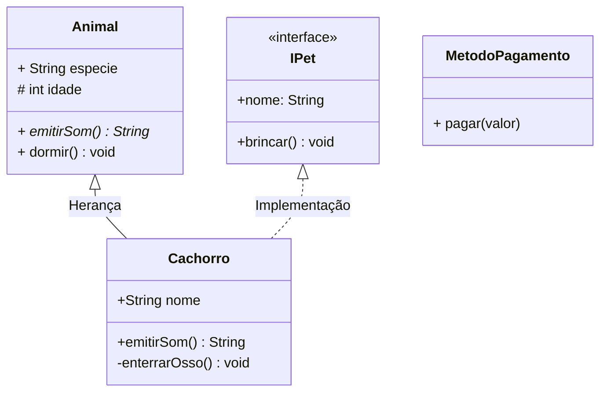

# Changing

- Aula explicada: 31/03/2026

## Problema

&emsp; Imagine um site de compras o-commerce

### Como podemos modelar uma solução para esse problema?

- **Adição** de novas formas de pagamento
- **Reordenação** das formas de pagamento referencial
- **Execução** do pagamento verificando em cada uma das formas se há saldo disponível

Clique para ver o código fonte do diagrama (Mermaid)

