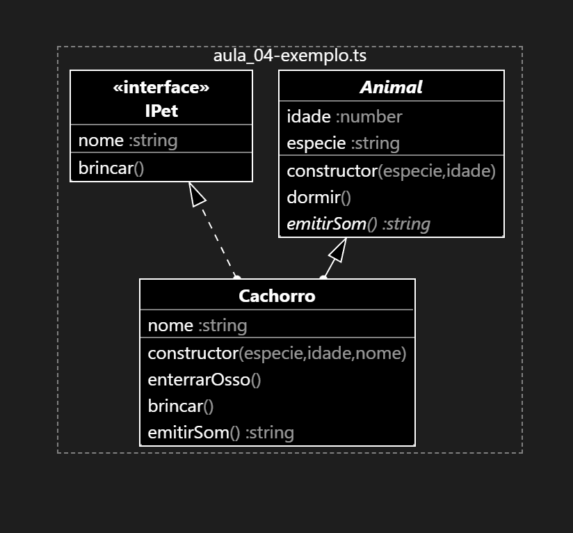

# Changing of Responsibility

- Aula explicada: 31/03/2026

## Problema

&emsp; Imagine um site de compras o-commerce

### Como podemos modelar uma solução para esse problema?

- **Adição** de novas formas de pagamento
- **Reordenação** das formas de pagamento referencial
- **Execução** do pagamento verificando em cada uma das formas se há saldo disponível



<details>
<summary>Clique para ver o código fonte do diagrama (Mermaid)</summary>


```ts
export abstract class Animal {
    protected idade: number;
    public especie: string;
    constructor(especie: string, idade: number) {
        this.especie = especie;
        this.idade = idade;
    }

    public dormir(): void {
        console.log("ZzzzZzzzZzZzZzZzZ")
    }

    abstract emitirSom(): string;
}

export interface IPet {
    nome: string;
    brincar(): void;
}

export class Cachorro extends Animal implements IPet {
    public nome: string;

    constructor(especie: string, idade: number, nome: string) {
        super(especie, idade);
        this.nome = nome;
    }

    private enterrarOsso(): void {
        console.log("Osso enterrado com sucesso.");
    }

    public brincar(): void {
        console.log(`${this.nome} está brincando com uma bolinha.`)
    }

    public emitirSom(): string {
        return "Au Au Au!"
    }
}
```